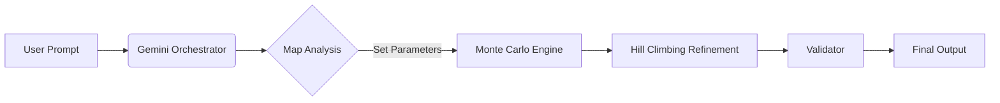

# Totalenergies-Hackathon-2026

> **3rd Place** - TotalEnergies AI Hackathon 2026 (University of Oviedo) 3rd out of 14 teams

> **Team:** License to Prompt (Solo Entry)  
> **Role:** Full Stack AI Engineer


## 📖 Overview
**License to Prompt** is a spatial optimization agent developed during the **TotalEnergies AI Hackathon 2026**.

The challenge required placing electrical transformers on a grid map to power a city while adhering to strict safety and efficiency rules. While many competitors relied solely on LLMs (which often hallucinate coordinates), this solution implements a **Hybrid Neuro-Symbolic Architecture**:

1.  **Cognitive Layer (Gemini):** Understands the task, analyzes map dimensions, and orchestrates the tool usage.
2.  **Mathematical Layer (Python):** Executes a **Directed Monte Carlo** simulation combined with **Hill Climbing** to ensure 100% rule compliance and mathematical optimality.

---

## 🎯 The Challenge
The goal was to place `N` transformers ('C') on a 2D grid to minimize the distance to critical infrastructure.

### The Constraints (The Hard Part)
* **Residential Rule:** Transformers must have at least one Residential Zone ('X') in their 8-neighbor radius.
* **Safety Rule:** Transformers cannot be adjacent to existing Substations ('E').
* **Terrain Rule:** Can only be placed on empty spots ('-').

### Optimality Criteria
* **Industry Coverage:** Every Industry ('T') must be served by at least **2 transformers** within a **3-tile radius** (Manhattan distance).
* **Hospital Efficiency:** Minimize the total distance from all Hospitals ('O') to their nearest transformer.

<p align="center">
  
</p>
---

## 🏗️ Architecture
The system is built on a "Brain & Muscle" separation of concerns to avoid LLM hallucinations:

| Component | Technology | Responsibility |
| :--- | :--- | :--- |
| **The Brain** | Google Gemini 2.5 Flash | Parses user intent, determines map size, and calculates the `iteration_strength`. |
| **The Muscle** | Python (NumPy/Random) | Executes 5,000+ stochastic simulations per second to find global minima. |
| **The Polisher** | Hill Climbing Algorithm | Refines the best seed pixel-by-pixel to minimize distances. |

### Workflow Diagram


---

## 💻 Tech Stack

* **Core Logic:** Python 3.10+
* **Orchestration:** `llama-index` (FunctionAgent, FunctionTools)
* **LLM Provider:** Google Gemini API (`gemini-2.5-flash`)
* **Algorithms:**
    * **Monte Carlo Search:** For global exploration.
    * **BFS (Breadth-First Search):** For validating "real" walking distances vs walls.
    * **Hill Climbing:** For local optimization.

---

## 📂 Project Structure

```text
Totalenergies-Hackathon-2026/
├── inputs/                 # Raw map files provided by TotalEnergies
├── outputs/                # Optimized solutions generated by the agent
├── images/                 # Images needed for the visualizer
├── src/
│   ├── main.py             # Core Neuro-Symbolic Agent logic
│   ├── validator.py        # Rule compliance testing unit
│   └── visualizer.py       # Heatmap generation
├── requirements.txt        # Project dependencies
└── README.md
```

---

## 🚀 Installation & Usage

### 1. Clone the repository
```bash
git clone [https://github.com/iyangarcia/Totalenergies-Hackathon-2026.git](https://github.com/iyangarcia/Totalenergies-Hackathon-2026.git)
cd Totalenergies-Hackathon-2026
```

### 2. Install dependencies
This project requires Python 3.10+. Install the necessary libraries using the requirements file included in the repo:
```bash
pip install -r requirements.txt
```

### 3. Set up your API Key
This agent uses **Google Gemini 2.5 Flash**. You must set your API key in `main.py`.


### 4. Run the Agent
```bash
python src/main.py
```
The agent will:
1.  Read the map from `inputs/`.
2.  Decide the strategy (iterations) based on map size.
3.  Generate the optimal solution.
4.  Save the result to `outputs/`.

### 5. Validate & Visualize (Manual Tools)
After the agent finishes, you can verify the result and generate a heatmap manually:

**Get the Score:**
Runs the strict rule checker and calculates the final efficiency score.
```bash
python src/validator.py
# Output Example: "Final Score: 26"
```

**Generate Visual Map:**
Creates a PNG image showing the placement of transformers from the input and output files.
```bash
python src/visualizer.py
```

---

### 👤 Author
**Iyán García** *Full Stack AI Engineer | 3rd Place Winner*
