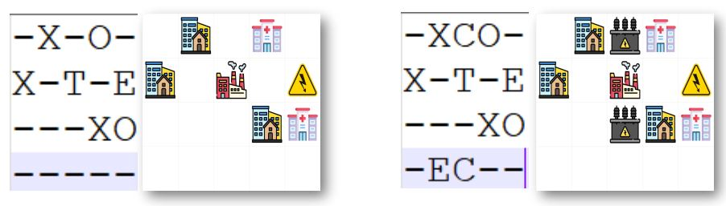
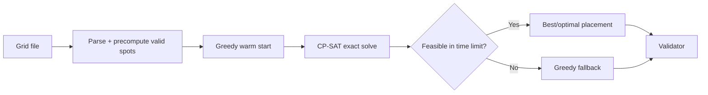

# Totalenergies-Hackathon-2026

> **3rd Place** - TotalEnergies AI Hackathon 2026 (University of Oviedo) 3rd out of 14 teams
>
> This repo has since been revised outside the contest to see how much better an
> exact-optimization approach performs versus the original Monte Carlo solver.
> See [Revision notes](#-revision-notes-post-contest) for what changed and why.
> The original submitted code is preserved as-is in
> [`archive/original-submission/`](archive/original-submission/) for comparison.

> **Team:** License to Prompt (Solo Entry)
> **Role:** Full Stack AI Engineer


## Overview
The challenge: place `N` transformers ('C') on a 2D grid to power a city, subject to
placement rules, while minimizing distance from transformers to hospitals and industries.

### The Constraints
* **Residential Rule:** Transformers must have at least one Residential Zone ('X') in their 8-neighbor radius.
* **Safety Rule:** Transformers cannot be adjacent to existing Substations ('E').
* **Terrain Rule:** Can only be placed on empty spots ('-').
* **Industry Coverage:** Every Industry ('T') must be served by at least **2 transformers** within a **3-tile radius** (Manhattan distance).

### Optimality Criteria
Minimize the total Manhattan distance from every Hospital ('O') and Industry ('T') to its nearest transformer.

<p align="center">
  
</p>

---

## Architecture

Every cell on this grid is traversable — there are no walls. That means a BFS
shortest path between two points is always identical to their Manhattan
distance, so **the whole problem is exact, static geometry**: no simulation,
no search over "maybe" paths, no LLM required to interpret it.

The solver is therefore a straight **facility location problem with a coverage
constraint** (a k-median variant), formulated exactly and solved with
[Google OR-Tools CP-SAT](https://developers.google.com/optimization/cp):

1. **Candidate spots** are precomputed once (empty cell, adjacent to a residential
   zone, not adjacent to a substation).
2. **Greedy construction** (`solver.py::greedy_construct`) builds a fast, fully
   vectorized (NumPy) starting solution: it covers industries first (choosing
   whichever spot resolves the most outstanding coverage need at each step),
   then fills remaining transformer slots with classic greedy facility-location
   additions (each pick is the one that most reduces total demand distance).
   This alone is deterministic, always valid, and takes ~1 second even on a
   100x100 map with 5,000+ candidate spots.
3. **Exact ILP refinement** (`solver.py::solve_ilp`) takes that greedy solution
   as a warm-start hint and searches for the true optimum with CP-SAT: binary
   variables for which spots are open, assignment variables for which open
   spot serves each demand point, an explicit industry double-coverage
   constraint, minimizing total assigned distance. Given enough time it proves
   optimality (lower bound == solution); if it runs out of time on a very
   large instance it always falls back to the guaranteed-valid greedy solution
   instead of failing.


```mermaid
graph LR
    A[Grid file] --> B[Parse + precompute valid spots];
    B --> C[Greedy warm start];
    C --> D[CP-SAT exact solve];
    D --> E{Feasible in time limit?};
    E -->|Yes| F[Best/optimal placement];
    E -->|No| G[Greedy fallback];
    F --> H[Validator];
    G --> H;
```

There is no LLM anywhere in this pipeline. There used to be one — see below.

---

## Tech Stack
* **Core Logic:** Python 3.10+
* **Solver:** [OR-Tools](https://developers.google.com/optimization) CP-SAT
* **Numerics:** NumPy (vectorized Manhattan distance matrices)
* **Tests:** pytest

---

## 📂 Project Structure
```text
totalenergies-hackathon-2026/
├── inputs/
│   ├── 1.txt                # 100x100 exposition map (bigger, more visually striking demo)
│   └── 20x20/1.txt          # The original contest map (20x20, 28 transformers)
├── outputs/                 # Solver output (git-ignored, generated at runtime)
├── images/                  # Images used by the visualizer
├── archive/
│   └── original-submission/ # The exact code submitted at the hackathon, kept for comparison
├── src/
│   ├── grid.py              # Grid parsing, valid-spot rules, Manhattan distance, scoring
│   ├── solver.py            # Greedy construction + CP-SAT exact solver
│   ├── main.py               # CLI entry point
│   ├── validator.py         # Independent rule-compliance checker + scorer
│   └── visualizer.py        # Heatmap generation
├── tests/
│   └── test_solver.py       # Correctness + optimality tests
├── requirements.txt
└── README.md
```

---

## Installation & Usage

### 1. Clone and install
```bash
git clone https://github.com/iyangarcia/totalenergies-hackathon-2026.git
cd totalenergies-hackathon-2026
pip install -r requirements.txt
```

### 2. Run the solver
On the original 20x20 contest map (28 transformers):
```bash
python src/main.py --input 20x20/1.txt --count 28 --time-limit 10
# score=39, proven optimal, in ~0.2s
```
On the bigger 100x100 exposition map, pick a transformer count that fits it
(the default of 28 is sized for the small map):
```bash
python src/main.py --input 1.txt --count 350 --time-limit 15
```
Both print solver status, the exact score, the proven lower bound (if any),
and save the placement to `outputs/<input filename>`.

Flags:
* `--count`: number of transformers to place (default 28).
* `--time-limit`: CP-SAT time budget in seconds (default 10).
* `--candidates`: max nearest-spot candidates considered per demand point,
  keeps very large maps tractable (default 60).
* `--greedy-only`: skip the ILP, just report the instant greedy solution.

### 3. Validate & visualize
```bash
python src/validator.py --input 20x20/1.txt --count 28
# Final Score: 39

python src/visualizer.py --input 20x20/1.txt
```

---

## Revision notes (post-contest)

The original submission used an LLM (Gemini 2.5 Flash) to pick a single
hyperparameter and orchestrate two tool calls, and a Monte Carlo + hill
climbing search for placement. On revisiting it, benchmarking against the
actual contest map turned up:

| | Original (Monte Carlo + LLM) | Revised (Greedy + CP-SAT) |
|---|---|---|
| Time (contest map, `inputs/20x20/1.txt`, 28 transformers) | 151s for 5,000 iterations | **0.19s** |
| Score | 41 (not proven optimal) | **39, proven optimal** |
| Proof of optimality | None | Yes (lower bound == score) |
| LLM in the critical path | Yes | No |

Why the original was slow and imprecise:
* It used BFS to compute distances "to avoid walls" — but every cell on this
  grid is traversable, so BFS distance is always identical to Manhattan
  distance. The BFS layer added cost for a distinction that can't exist here.
* It recomputed the same per-industry candidate filtering on every one of
  5,000 iterations instead of once, and recomputed a full distance-sum score
  from scratch for every hill-climbing move.
* With `2 x industries > transformer count` (true on the actual contest map:
  18 industries need up to 36 slots but only 28 transformers are available),
  a `list[:C_AMOUNT]` truncation could silently drop transformers another
  industry needed — around 22% of Monte Carlo iterations were discarded
  because of this, not bad luck.
* The LLM's only real job was picking one integer (iteration count) and
  relaying a coordinate list as text between two tool calls — adding latency,
  cost, and a channel through which coordinates could still be garbled, which
  is exactly the failure mode the "hybrid" architecture claimed to avoid.

The revised version treats this as what it actually is: a small, exactly
specifiable facility-location problem, solved with a real combinatorial
optimizer instead of random sampling.

### 👤 Author
**Iyán García** *Full Stack AI Engineer | 3rd Place Winner*
